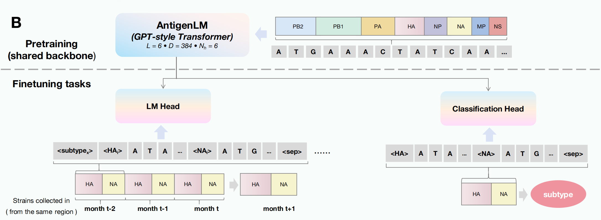

<h3 align="center"><strong>AntigenLM : Structure-Aware DNA Language Modeling for Influenza</strong></h3>

<p align="center">
    <a href="">Yue Pei</a>,
    <a href="">Xuebin Chi</a>,
    <a href=""> Yu Kang</a>,
    <br>
    <br>
    <b>ICLR 2026</b>
</p>

<div align="center">
 <a href='https://arxiv.org/abs/2602.09067'></a> &nbsp;&nbsp;&nbsp;&nbsp;&nbsp;
 <a href='LICENSE'></a> &nbsp;&nbsp;&nbsp;&nbsp;&nbsp;
 <br>
</div>
<br>

<p align="center">

</p>

## Contents

- `prediction_sequence/`: generation model (config + tokenizer + weights)
- `subtype_classifier/`: subtype classifier model (config + tokenizer + weights)
- `demo/`: one real sample per task (generation / classification)
- `run_generate.py`, `run_classify.py`: inference runners
- `lib/`: model / tokenizer / generation helpers
- `environment.yml`: conda environment

## Setup

```bash
conda env create -f environment.yml --solver=libmamba
conda activate antigenlm
```

This environment is **CUDA** (`pytorch-cuda=11.7`).

If you clone without Git LFS files, install [Git LFS](https://git-lfs.com) and run `git lfs pull`, or download weights from HuggingFace:

- [`Moonn1205/AntigenLM-prediction-sequence`](https://huggingface.co/Moonn1205/AntigenLM-prediction-sequence)
- [`Moonn1205/AntigenLM-subtype-classifier`](https://huggingface.co/Moonn1205/AntigenLM-subtype-classifier)

```bash
python - <<'PY'
from huggingface_hub import snapshot_download
snapshot_download(repo_id="Moonn1205/AntigenLM-prediction-sequence", local_dir="prediction_sequence", local_dir_use_symlinks=False)
snapshot_download(repo_id="Moonn1205/AntigenLM-subtype-classifier", local_dir="subtype_classifier", local_dir_use_symlinks=False)
PY
```

## Generation

```bash
python run_generate.py \
  --model_dir prediction_sequence \
  --input_jsonl demo/generate.jsonl \
  --output_jsonl out/generate_preds.jsonl
```

## Classification

```bash
python run_classify.py \
  --model_dir subtype_classifier \
  --input_jsonl demo/classify.jsonl \
  --output_csv out/classify_pred.csv
```

## Input format

- Generation JSONL: each line must contain `input`
- Classification JSONL: each line must contain `input` and (optionally) `label`
